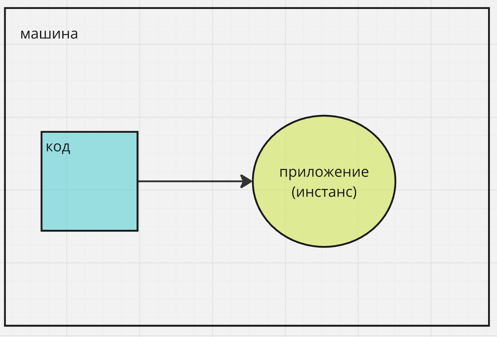

# Часть 2 - "Что такое контейнер и зачем он нам нужен"

## Проблема и её решение контейнером

Если мы будем разворачивать приложение вручную, можем столкнуться с такими проблемами:

- Разные версии операционных систем и пакетов (Windows, macOS, Linux) → "у меня работает, у тебя — нет".
- Приложения не изолированы и могут конфликтовать друг с другом.
- При возникновении ошибки приложение не запустится автоматически.
- Сложности в развертывании приложения на нескольких серверах.

Контейнер решает эти проблемы, изолируя приложение со всем необходимым для его запуска. Это позволяет запускать приложение в идентичном окружении на любой машине, независимо от ОС, что упрощает развертывание и обновление.

---

## Стадии получения контейнера

### Было:

Код → Инстанс (работающее приложение)


### Стало:

Код + Dockerfile → Образ (Image) → Контейнер (инстанс, работающее приложение)


---

## Dockerfile

Dockerfile — это инструкции для получения Docker-образа путем сборки. В нем указываются все необходимые команды и настройки окружения для нашего приложения.

[Пример Dockerfile](./Dockerfile)

---

## Установка Docker

Для работы с контейнерами нам нужен установленный Docker. Проверить его наличие можно командой:

```sh
docker --version
```

Если его нет, установите Docker с [официального сайта](https://www.docker.com/products/docker-desktop). Установка через пакетный менеджер может быть сложной.

---

## Сборка образа (создание образа из кода по инструкции из Dockerfile)

Находясь в папке `part2`, выполните команду:
Которая согласно инструкциям соберет из нашего кода образ приложения.

```sh
docker build -t my_app .
```

Где:

- `-t` — задает имя образа (`my_app`).
- `.` — путь к `Dockerfile` (текущая папка).

---

## Запуск приложения в контейнере

После сборки мы получаем образ, который можно:

- Передать другу.
- Запустить локально, на стейдже/проде с одинаковым поведением.

Запускаем локально контейнер из образа:

```sh
docker run -p 1234:1234 -d my_app
```

Где:

- `-p 1234:1234` — пробрасывает порт.
- `-d` — запускает контейнер в фоне (не блокирует консоль).

Проверить запущенные контейнеры:

```sh
docker ps
```

## Какие еще есть простые команды

Посмотреть образы на машине:

```sh
docker images
```

Остановить контейнер:

```sh
docker stop <container_id>
```

Запустить заново:

```sh
docker start <container_id>
```

Удалить контейнер:

```sh
docker rm <container_id>
```

Удалить образ:

```sh
docker rmi <image_id>
```

### Инстанс = Контейнер

При запуске контейнера создается инстанс приложения. Так как в контейнере чаще всего одно приложение, можно упростить и сказать: **контейнер = инстанс = приложение**.


---

## Пример запроса к контейнеру

После запуска контейнера:

```sh
curl http://localhost:1234/hello
```

Ожидаемый результат: `Hello, world!` (или измененная вами строка).  
Либо можно в браузере перейти по адресу `http://localhost:1234/hello`.

---

## Пример невалидного запроса к контейнеру

Выполним запрос:

```sh
curl http://localhost:1234/die
```

Ожидаемый результат: сервер больше не отвечает на запросы.

Проверим работающие контейнеры:

```sh
docker ps
```

Контейнер не будет отображен. Чтобы увидеть остановленные контейнеры:

```sh
docker ps -a
```

Где `-a` — показывает все контейнеры.

---

## Запуск контейнера с политикой восстановления

Запустите контейнер с автоматическим рестартом:

```sh
docker run -d --restart unless-stopped -p 1234:1234 my_app
```

Где:

- `--restart unless-stopped` — автоматически перезапускает контейнер, если он остановился не по команде пользователя.

---

## Проверка работы восстановления

1. Запустите контейнер с политикой рестарта.
2. Перейдите по адресу `http://localhost:1234/die`.
3. В контейнере произойдет ошибка, но он перезапустится автоматически.
4. Мы снова можем отправить запрос на `http://localhost:1234/hello`.
5. Чтобы увидеть логи контейнера можно выполнить команду:

```
docker logs <container_id>
```

## Контрольные вопросы

1. Сколько различных инстансов мы запустили в ходе урока?
2. Какие преимущества контейнеров были рассмотрены в уроке?
3. Если у нас есть политики восстановления, почему тогда все же приложения отказывают? (этого нет в уроке)

[Ответы](./answers.md)
