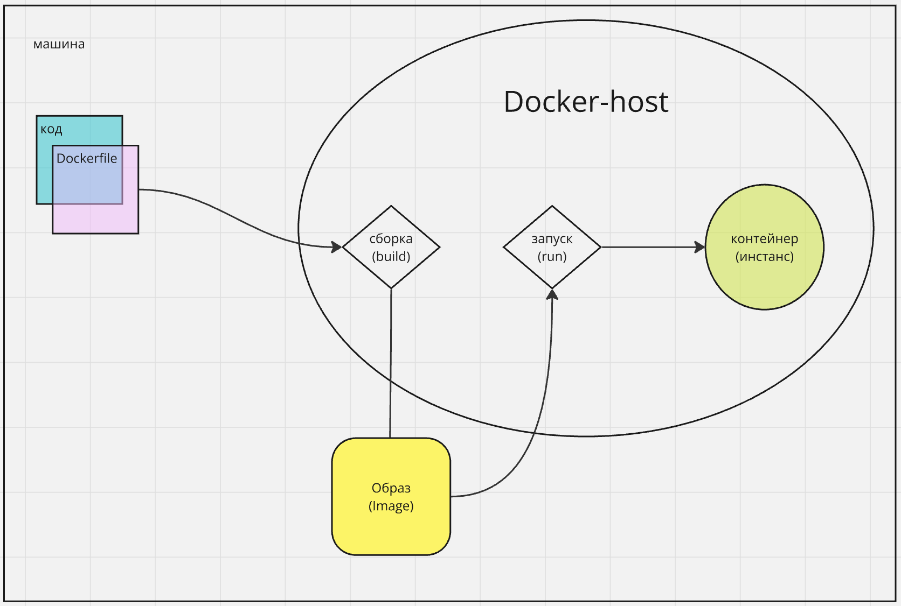

# Часть 2 - "Что такое контейнер и зачем он нам нужен"

- какая проблемы есть и их решает контейнер?
- контейнер как вариант ее решения
- стадия получения контейнера
- Dockerfile
- билд нашего приложения
- запуска нашего приложения в контейнере
- инстанс равен контейнеру
- пример запроса к нему
- пример невалидного запроса к нему
- запускаем наш контейнер с политикой восстановления
- убеждаемся что восстановление работает
- контрольные вопросы

## Проблема и её решение контейнером

Если мы будем разворачивать приложение вручную, можем столкнуться с такими проблемами:

- Разные версии операционных систем и пакетов (Windows, macOS, Linux) → "у меня работает, у тебя — нет".
- Приложения не изолированы и могут конфликтовать друг с другом.
- При возникновении ошибки приложение не запустится автоматически.
- Сложности в развертывании приложения на нескольких серверах.

Контейнер решает эти проблемы, изолируя приложение со всеми его зависимостями в одном образе. Это позволяет запускать приложение в идентичном окружении на любой машине, независимо от ОС, что упрощает развертывание и обновление.

---

## Стадии получения контейнера

### Было:

Код → Инстанс (работающее приложение)


### Стало:

Код + Dockerfile → Образ (Image) → Контейнер (инстанс, работающее приложение)


---

## Dockerfile

Dockerfile — это сценарий (текстовый файл) с инструкциями для сборки Docker-образа. В нем указываются все необходимые зависимости, команды и настройки окружения для создания контейнера.

[Пример Dockerfile](./Dockerfile)

---

## Установка Docker

Для работы с контейнерами нам нужен установленный Docker. Проверить его наличие можно командой:

```sh
docker --version
```

Если его нет, установите Docker с [официального сайта](https://www.docker.com/products/docker-desktop). Установка через пакетный менеджер может быть сложной.

---

## Сборка образа

Находясь в папке `part2`, выполните команду:

```sh
docker build -t my_app .
```

Где:

- `-t` — задает имя образа (`my_app`).
- `.` — путь к `Dockerfile` (текущая папка).

---

## Запуск приложения в контейнере

После сборки образа его можно:

- Передать другу.
- Запустить локально, на стейдже/проде с одинаковым поведением.

Запускаем контейнер:

```sh
docker run -p 1234:1234 -d my_app
```

Где:

- `-p 1234:1234` — пробрасывает порт.
- `-d` — запускает контейнер в фоне (не блокирует консоль).

Проверить запущенные контейнеры:

```sh
docker ps
```

Посмотреть образы на машине:

```sh
docker images
```

Остановить контейнер:

```sh
docker stop <container_id>
```

Запустить заново:

```sh
docker start <container_id>
```

Удалить контейнер:

```sh
docker rm <container_id>
```

Удалить образ:

```sh
docker rmi <image_id>
```

### Инстанс = Контейнер

При запуске контейнера создается инстанс приложения. Так как в контейнере чаще всего одно приложение, можно упростить и сказать: **контейнер = инстанс = приложение**.


---

## Пример запроса к контейнеру

После запуска контейнера:

```sh
curl http://localhost:1234/hello
```

Ожидаемый результат: `Hello, world!` (или измененная вами строка).

---

## Пример невалидного запроса к контейнеру

Выполним запрос:

```sh
curl http://localhost:1234/die
```

Ожидаемый результат: сервер больше не отвечает на запросы.

Проверим работающие контейнеры:

```sh
docker ps
```

Контейнер не будет отображен. Чтобы увидеть остановленные контейнеры:

```sh
docker ps -a
```

Где `-a` — показывает все контейнеры.

---

## Запуск контейнера с политикой восстановления

Запустите контейнер с автоматическим рестартом:

```sh
docker run -d --restart unless-stopped -p 1234:1234 my_app
```

Где:

- `--restart unless-stopped` — автоматически перезапускает контейнер, если он остановился не по команде пользователя.

---

## Проверка работы восстановления

1. Запустите контейнер с политикой рестарта.
2. Перейдите по адресу `http://localhost:1234/die`.
3. В контейнере произойдет ошибка, но он перезапустится автоматически.
4. Мы снова можем отправить запрос на `http://localhost:1234/hello`.
5. Чтобы увидеть логи контейнера можно выполнить команду:

```
docker logs <container_id>
```

## Контрольные вопросы

1. Какую проблему решает использование контейнера?
2. Чем контейнер отличается от традиционного инстанса приложения?
3. Что описывает Dockerfile?
4. Какую команду вы используете для сборки образа?
5. Какой командой запускается контейнер с политикой восстановления?
6. Что произойдет при выполнении невалидного запроса к контейнеру?
